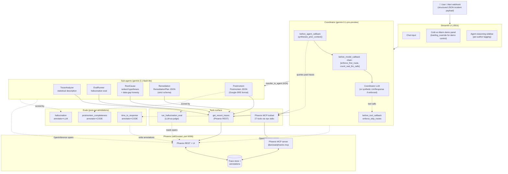
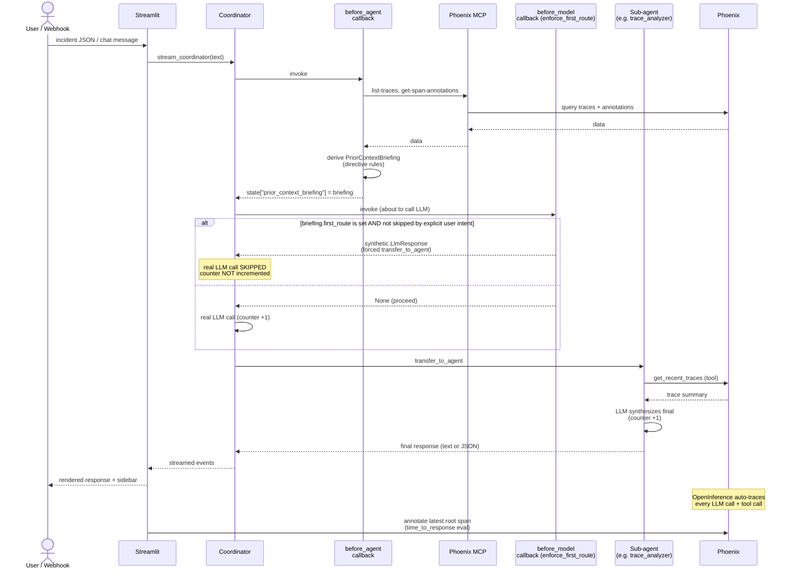
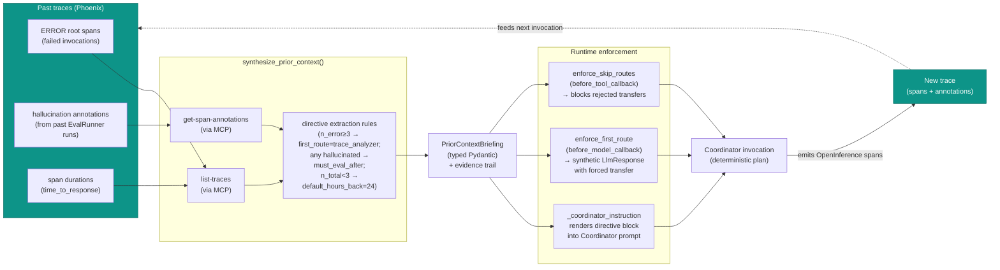
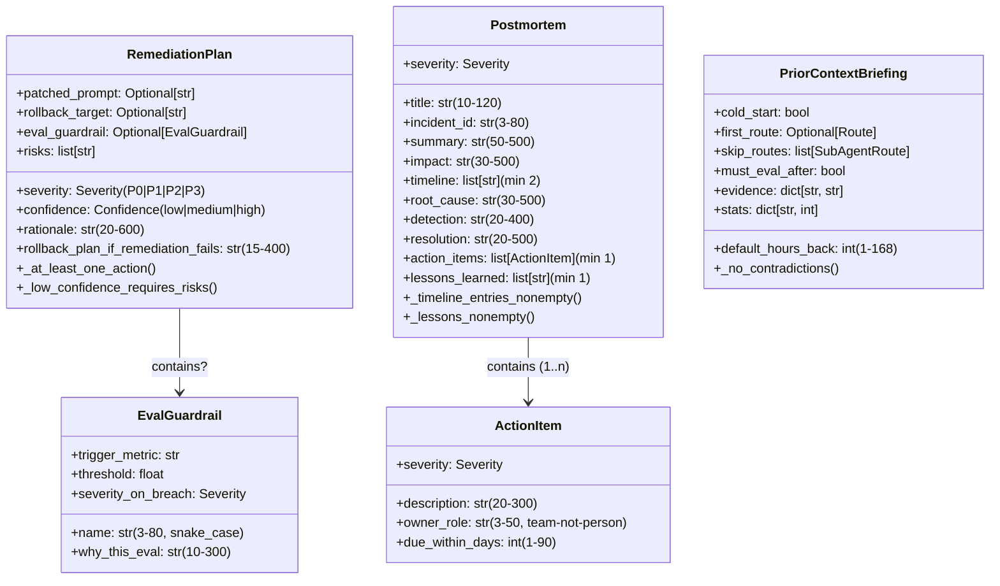

# Sentinel — System Architecture

A multi-agent incident response system for production AI in financial-services workflows (fraud detection, KYC/AML, lending, wealth management). The differentiator is a runtime **self-improvement loop**: Sentinel queries its own Phoenix traces via MCP and uses trace-derived directives to deterministically shape the plan it executes on each invocation.

This document is the canonical view of how the pieces fit together. All diagrams are [Mermaid](https://mermaid.live/) — they render natively on GitHub, in VS Code's Markdown preview (Ctrl+Shift+V; install the "Markdown Preview Mermaid Support" extension if a diagram shows as raw text), and at [mermaid.live](https://mermaid.live/).

---

## 1. System topology

The full production topology — five sub-agents, one root Coordinator, two observability surfaces (REST + MCP), three eval suites.

---

## 2. Per-request flow (sequence)

What happens between the user hitting Send and the response landing back.

---

## 3. The self-improvement loop (the differentiator — ADR-009)

This is the load-bearing piece for Arize judging criteria #1 ("self-improvement loop") and #2 ("Phoenix MCP load-bearing, not bolted on"). The loop is **deterministic** because directives are enforced at runtime, not just suggested in a prompt.

**Why this works on camera (the supervisor's gate):** the 5-run cold-vs-warm reproduction (in `scripts/repro_cold_vs_warm.py`, table in `docs/repro-cold-vs-warm.md`) shows a **strict 3→2 LLM-round-trip delta on 5/5 runs** when warm runs the live synthesizer against real Phoenix data. Both sides of the comparison are reproducible because the directive enforcement bypasses the Coordinator's routing LLM call entirely when active.

---

## 4. Data contracts (Pydantic schemas)

Cross-agent contracts in `sentinel/agents/schemas.py`. These are the production-shape outputs that ticketing systems, audit logs, and downstream sub-agents consume. Each is validated at construction time — bad data fails loud.

---

## 5. Component map (where each piece lives)

| Layer | Component | Path | Tests |
|---|---|---|---|
| **UI** | Streamlit app | `sentinel/ui/app.py` | — |
| **Coordinator** | LlmAgent, instruction provider, callbacks | `sentinel/coordinator.py` | covered via `tests/unit/memory/test_instruction.py` |
| **Sub-agent** | TraceAnalyzer | `sentinel/agents/trace_analyzer.py` + `sentinel/prompts/trace_analyzer.md` | — |
| **Sub-agent** | EvalRunner | `sentinel/agents/eval_runner.py` + `sentinel/prompts/eval_runner.md` | — |
| **Sub-agent** | RootCause | `sentinel/agents/root_cause.py` + `sentinel/prompts/root_cause.md` | — |
| **Sub-agent** | Remediation | `sentinel/agents/remediation.py` + `sentinel/prompts/remediation.md` | schema in `tests/unit/agents/test_schemas.py` |
| **Sub-agent** | Postmortem | `sentinel/agents/postmortem.py` + `sentinel/prompts/postmortem.md` | schema in `tests/unit/agents/test_schemas.py` |
| **Schemas** | RemediationPlan, EvalGuardrail, Postmortem, ActionItem, POSTMORTEM_REQUIRED_SECTIONS | `sentinel/agents/schemas.py` | 23 unit tests |
| **Self-improvement** | PriorContextBriefing schema | `sentinel/memory/briefing.py` | 10 unit tests |
| **Self-improvement** | synthesize_prior_context, briefing_override | `sentinel/memory/self_introspection.py` | 10 unit tests (with mocked MCP) |
| **Self-improvement** | enforce_first_route, enforce_skip_routes, count_real_llm_calls | `sentinel/memory/enforcement.py` | 3 integration tests on real LLM |
| **Tool** | get_recent_traces (Phoenix REST) | `sentinel/tools/phoenix_traces.py` | — |
| **Tool** | run_hallucination_eval (orchestrator) | `sentinel/tools/run_eval.py` | — |
| **Observability** | OpenInference → Phoenix wiring | `sentinel/observability/instrumentation.py` | — |
| **Observability** | Phoenix MCP toolset factory | `sentinel/observability/phoenix_mcp.py` | — |
| **Eval** | time_to_response (latency annotation) | `evals/time_to_response.py` | — |
| **Eval** | hallucination (LLM-as-judge) | `evals/hallucination.py` | — |
| **Eval** | postmortem_completeness (code scorer) | `evals/completeness.py` | 11 unit tests |
| **Eval** | per-incident metrics dataclass | `evals/incident_metrics.py` | 9 unit tests |
| **Demo** | 5-run cold-vs-warm repro script | `scripts/repro_cold_vs_warm.py` | — |
| **Docs (judge-facing)** | Repro evidence | `docs/repro-cold-vs-warm.md` | — |
| **Docs (judge-facing)** | This architecture | `docs/architecture.md` | — |

**Test totals:** 81 unit + 3 integration = **84 tests passing**.

---

## 6. Models + region

| Role | Model ID | Region | Note |
|---|---|---|---|
| `COORDINATOR_MODEL` | `gemini-3.1-pro-preview` | `global` | Pro for routing + drafting. Preview status — see ADR-010. Fallback documented in `sentinel/constants.py`. |
| `SUBAGENT_MODEL` | `gemini-3.1-flash-lite` | `global` | GA. Flash sufficient for tool-heavy sub-agents. |
| Hallucination judge | `gemini-3.1-flash-lite` | `global` | Used by `evals/hallucination.py` via google-genai direct (not ADK). |

All inference routes through Vertex AI in the `global` multi-regional endpoint. The Gemini 3 family is not served in `us-central1` (404). See ADR-010 in `context/04-decisions.md`.

---

## 7. Known limitations (current)

- **P2 — `must_eval_after` multi-transfer:** when the active directive sets `must_eval_after=True` AND the user explicitly requests a non-eval sub-agent, the Coordinator's LLM may emit BOTH `transfer_to_agent(<requested>)` AND `transfer_to_agent(eval_runner)` in one model turn. ADK appears to honor only one transfer per turn, so the primary intent can drop. Detailed entry in `context/07-known-issues.md`. Fix is `after_agent_callback`-based enforcement parallel to `enforce_first_route`. Workaround: the cold-vs-warm demo panel forces `cold_start=True` to bypass.
- **Multi-transfer in chained scenarios** (Phase 4 step 5 will hit this — three-incident end-to-end flow needs the P2 fix to chain cleanly).
- **`scripts/_repro.log`** is regeneratable runtime output (gitignored). To produce a fresh table: `RUN_INTEGRATION_TESTS=1 uv run python scripts/repro_cold_vs_warm.py --runs 5`.

---

## 8. How to view / regenerate this doc

**Render the diagrams:**
- **GitHub:** push the file — Mermaid renders inline automatically.
- **VS Code:** `Ctrl+Shift+V` for Markdown Preview. If a diagram shows as raw text, install the extension "Markdown Preview Mermaid Support" (publisher: `bierner`) — one-time setup.
- **Standalone, no install:** copy any \`\`\`mermaid block into [https://mermaid.live/](https://mermaid.live/).
- **PNG export:** use Mermaid Live's export button, or `npx -p @mermaid-js/mermaid-cli mmdc -i docs/architecture.md -o docs/architecture.png` (requires Node).

**Update this doc when:**
- A sub-agent is added/removed (Section 1, Section 5 component map).
- A schema field changes (Section 4 class diagram + cross-reference `tests/unit/agents/test_schemas.py`).
- The model swap happens again (Section 6 model table — link the new ADR).
- A known limitation is resolved (Section 7).
