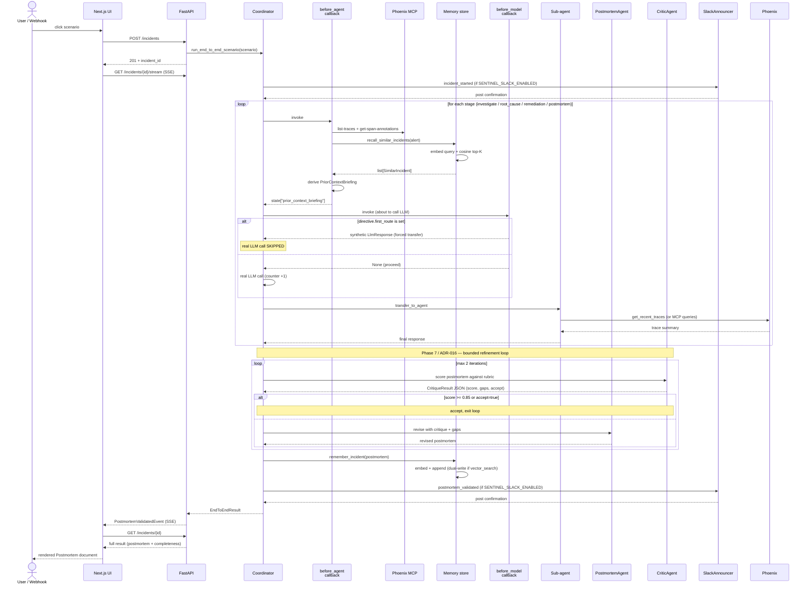
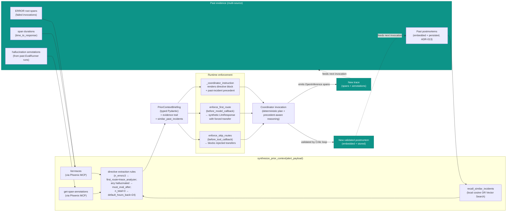
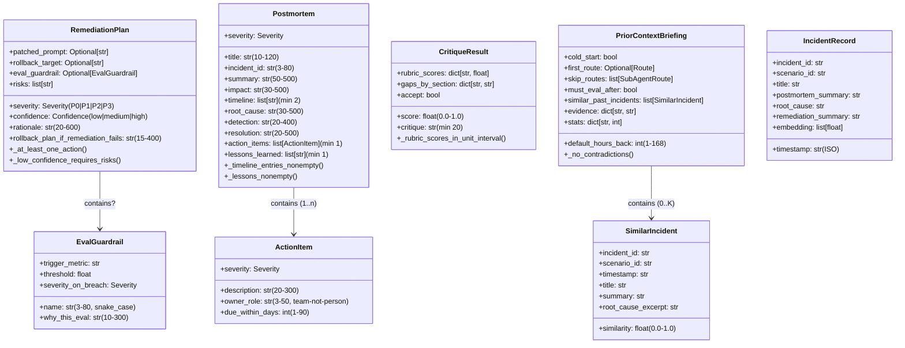

# Sentinel — System Architecture

Open-source AI SRE framework. Multi-agent incident response for production AI workloads (demonstrated for financial-services: fraud detection, KYC/AML, lending). The differentiator is a runtime **self-improvement loop** built on two compounding mechanisms:

1. **Phoenix MCP self-introspection** — Sentinel queries its own past Phoenix traces and derives typed routing directives the Coordinator MUST honor on the next turn.
2. **Persistent memory + RAG over past postmortems** — every completed incident is embedded (Vertex `text-embedding-004`) and persisted. The next incident's briefing includes top-K similar past incidents, cited by ID.

This document is the canonical view of how the pieces fit together. All diagrams are [Mermaid](https://mermaid.live/) — they render natively on GitHub, in VS Code's Markdown preview (Ctrl+Shift+V; install the "Markdown Preview Mermaid Support" extension if a diagram shows as raw text), and at [mermaid.live](https://mermaid.live/).

> **Last verified:** 2026-06-05 (Phase 8 complete: 8 new agents — CustomerImpactQuantifier, ComplianceOfficer w/ regulatory RAG, PromptEvolver, PatternMiner, DriftDetective, BiasFairnessAuditor, SLOGuardian, HumanOverrideGate, SentinelMonitor; 9-page UI surface; 18 ADRs). Phase 7 (ParallelAgent eval fan-out, RAG memory, GitHub MCP + DeployCorrelator, CriticAgent + refinement loop, Slack MCP + SlackAnnouncer) remains the baseline.

---

## 1. System topology

Eight sub-agents under one Coordinator. Three observability surfaces (Phoenix REST, Phoenix MCP, GitHub MCP, Slack MCP). One persistent memory store with two backend options (local JSONL + cosine, or Vertex AI Vector Search + sidecar — selectable via env).

```mermaid
flowchart TB
    User["👤 User / Alert webhook<br/>(POST /incidents JSON payload)"]

    subgraph UI["Next.js 14 UI (:3000)"]
        direction TB
        ScenarioPicker["Scenarios picker"]
        LiveConsole["Live agent-stepper console<br/>(SSE-driven)"]
        PMDoc["Postmortem document view<br/>(TanStack Query)"]
    end

    subgraph API["FastAPI (:8000)"]
        direction TB
        PostI["POST /incidents"]
        GetStream["GET /incidents/{id}/stream<br/>(SSE)"]
        GetI["GET /incidents/{id}"]
    end

    subgraph Coord["Coordinator (gemini-3.1-pro-preview)"]
        direction TB
        BAC["before_agent_callback<br/>synthesize_prior_context()<br/>+ recall_similar_incidents()"]
        BMC["before_model_callback chain:<br/>[enforce_first_route,<br/> count_real_llm_calls]"]
        BTC["before_tool_callback<br/>enforce_skip_routes"]
        CL["Coordinator LLM<br/>(or synthetic LlmResponse if enforced)"]
        BAC --> BMC --> CL
        CL -.tool calls.-> BTC
    end

    subgraph Sub["Sub-agents (gemini-3.1-flash-lite)"]
        direction LR
        TA["TraceAnalyzer<br/>statistical description"]
        ER["EvalRunner<br/>single-suite (hallucination)"]
        PER["ParallelEvalRunner (ADR-012)<br/>SequentialAgent + ParallelAgent<br/>fan-out: faithfulness, drift,<br/>prompt-injection, toxicity"]
        RC["RootCause (gemini-3.1-pro)<br/>ranked hypotheses<br/>+ data-gap honesty"]
        RM["Remediation (gemini-3.1-pro)<br/>RemediationPlan JSON"]
        PM["Postmortem<br/>Postmortem JSON<br/>(Google-SRE format)"]
        DC["DeployCorrelator (ADR-014)<br/>GitHub MCP queries<br/>commits + PRs in window"]
        CR["Critic (ADR-016)<br/>rubric scoring<br/>+ bounded refinement loop"]
        SLK["SlackAnnouncer (ADR-015)<br/>lifecycle event posts"]
    end

    subgraph Tools["Tools surface"]
        direction TB
        GRT["get_recent_traces<br/>(Phoenix REST)"]
        PHXMCP_T["Phoenix MCP toolset<br/>27 tools via npx stdio"]
        GHMCP_T["GitHub MCP toolset<br/>npx @modelcontextprotocol/server-github"]
        SLKMCP_T["Slack MCP toolset<br/>npx @modelcontextprotocol/server-slack"]
        RHE["run_hallucination_eval<br/>(LLM-as-judge)"]
        REVAL["run_{faithfulness, drift,<br/>prompt_injection, toxicity}_eval<br/>(code-eval stubs)"]
    end

    subgraph Mem["Persistent memory (ADR-013)"]
        direction TB
        EMB["embedder<br/>Vertex text-embedding-004"]
        STORE_SEL{"SENTINEL_MEMORY_BACKEND"}
        STORE_LOCAL["IncidentMemoryStore (local)<br/>data/memory/incidents.jsonl<br/>+ in-process cosine"]
        STORE_VS["VectorSearchMemoryStore (production)<br/>Vertex Matching Engine<br/>+ JSONL sidecar (dual-write)"]
        STORE_SEL -->|local (default)| STORE_LOCAL
        STORE_SEL -->|vector_search| STORE_VS
    end

    subgraph Phx["Phoenix (self-hosted :6006)"]
        direction TB
        PhxAPI["Phoenix REST + UI"]
        PhxMCP["Phoenix MCP server<br/>@arizeai/phoenix-mcp"]
        PhxDB[("Trace store +<br/>annotations")]
    end

    subgraph Evals["Evals (post-run annotations)"]
        direction LR
        TTR["time_to_response<br/>annotator=CODE"]
        HAL["hallucination<br/>annotator=LLM"]
        COMP["postmortem_completeness<br/>annotator=CODE"]
    end

    User --> UI
    UI --> API
    API --> Coord
    Coord -->|SSE events| API
    API -->|stream| LiveConsole

    Coord -->|"transfer_to_agent (A2A)"| Sub
    Coord --> GRT
    Coord --> PHXMCP_T

    TA --> GRT
    ER --> RHE
    PER --> REVAL
    RC --> GRT
    RM --> GRT
    PM --> GRT
    DC --> GHMCP_T
    SLK --> SLKMCP_T
    CR -.scores PM JSON.-> CR

    PM -.drafted JSON.-> CR
    CR -.critique + score.-> PM

    GRT --> PhxAPI
    PHXMCP_T --> PhxMCP
    RHE -.reads spans.-> PhxAPI
    REVAL -.reads spans.-> PhxAPI
    PhxAPI <--> PhxDB
    PhxMCP <--> PhxDB

    Coord -.OpenInference spans.-> PhxAPI
    Sub -.OpenInference spans.-> PhxAPI

    BAC -.queries past traces.-> PHXMCP_T
    BAC -.recall similar incidents.-> Mem
    PM -.remember after validation.-> Mem
    Mem --> EMB
    EMB -.Vertex embed API.-> PhxAPI

    Evals -.write annotations.-> PhxAPI
    PM -.scored by.-> COMP
    Coord -.scored by.-> TTR
    Sub -.scored by.-> HAL
```

---

## 2. Per-request flow (sequence)

What happens between a `POST /incidents` and the validated postmortem rendering on the frontend.

```mermaid
sequenceDiagram
    actor U as User / Webhook
    participant FE as Next.js UI
    participant API as FastAPI
    participant CO as Coordinator
    participant BAC as before_agent<br/>callback
    participant MCP as Phoenix MCP
    participant MEM as Memory store
    participant BMC as before_model<br/>callback
    participant SA as Sub-agent
    participant PM as PostmortemAgent
    participant CR as CriticAgent
    participant SLK as SlackAnnouncer
    participant PHX as Phoenix

    U->>FE: click scenario
    FE->>API: POST /incidents
    API->>CO: run_end_to_end_scenario(scenario)
    API-->>FE: 201 + incident_id
    FE->>API: GET /incidents/{id}/stream (SSE)

    CO->>SLK: incident_started (if SENTINEL_SLACK_ENABLED)
    SLK-->>CO: post confirmation

    loop for each stage (investigate / root_cause / remediation / postmortem)
        CO->>BAC: invoke
        BAC->>MCP: list-traces + get-span-annotations
        BAC->>MEM: recall_similar_incidents(alert)
        MEM->>MEM: embed query + cosine top-K
        MEM-->>BAC: list[SimilarIncident]
        BAC->>BAC: derive PriorContextBriefing
        BAC-->>CO: state["prior_context_briefing"]

        CO->>BMC: invoke (about to call LLM)
        alt directive.first_route is set
            BMC-->>CO: synthetic LlmResponse (forced transfer)
            Note over CO: real LLM call SKIPPED
        else
            BMC-->>CO: None (proceed)
            CO->>CO: real LLM call (counter +1)
        end

        CO->>SA: transfer_to_agent
        SA->>PHX: get_recent_traces (or MCP queries)
        PHX-->>SA: trace summary
        SA-->>CO: final response
    end

    Note over CO,CR: Phase 7 / ADR-016 — bounded refinement loop
    loop max 2 iterations
        CO->>CR: score postmortem against rubric
        CR-->>CO: CritiqueResult JSON (score, gaps, accept)
        alt score >= 0.85 or accept=true
            Note over CO,CR: accept, exit loop
        else
            CO->>PM: revise with critique + gaps
            PM-->>CO: revised postmortem
        end
    end

    CO->>MEM: remember_incident(postmortem)
    MEM->>MEM: embed + append (dual-write if vector_search)

    CO->>SLK: postmortem_validated (if SENTINEL_SLACK_ENABLED)
    SLK-->>CO: post confirmation

    CO-->>API: EndToEndResult
    API-->>FE: PostmortemValidatedEvent (SSE)
    FE->>API: GET /incidents/{id}
    API-->>FE: full result (postmortem + completeness)
    FE-->>U: rendered Postmortem document
```

---

## 3. The self-improvement loop (the differentiator — ADR-009 + ADR-013)

This is the load-bearing piece for Arize judging criteria #1 ("self-improvement loop") and #2 ("Phoenix MCP load-bearing, not bolted on"). Two compounding mechanisms:

```mermaid
flowchart LR
    subgraph Past["Past evidence (multi-source)"]
        Errs["ERROR root spans<br/>(failed invocations)"]
        Halluc["hallucination annotations<br/>(from past EvalRunner runs)"]
        Latency["span durations<br/>(time_to_response)"]
        PMStore["Past postmortems<br/>(embedded + persisted, ADR-013)"]
    end

    subgraph Synth["synthesize_prior_context(alert_payload)"]
        Q1["list-traces<br/>(via Phoenix MCP)"]
        Q2["get-span-annotations<br/>(via Phoenix MCP)"]
        Q3["recall_similar_incidents<br/>(local cosine OR Vector Search)"]
        Rules["directive extraction rules<br/>(n_error≥3 → first_route=trace_analyzer;<br/> any hallucinated → must_eval_after;<br/> n_total<3 → default_hours_back=24)"]
        Q1 --> Rules
        Q2 --> Rules
        Q3 --> Rules
    end

    Briefing["PriorContextBriefing<br/>(typed Pydantic)<br/>+ evidence trail<br/>+ similar_past_incidents"]

    subgraph Enforce["Runtime enforcement"]
        IP["_coordinator_instruction<br/>renders directive block<br/>+ past-incident precedent"]
        EFR["enforce_first_route<br/>(before_model_callback)<br/>→ synthetic LlmResponse<br/>with forced transfer"]
        ESR["enforce_skip_routes<br/>(before_tool_callback)<br/>→ blocks rejected transfers"]
    end

    NewRun["Coordinator invocation<br/>(deterministic plan +<br/>precedent-aware reasoning)"]
    NewTrace["New trace<br/>(spans + annotations)"]
    NewPM["New validated postmortem<br/>(embedded + stored)"]

    Errs --> Q1
    Latency --> Q1
    Halluc --> Q2
    PMStore --> Q3

    Rules --> Briefing
    Briefing --> IP
    Briefing --> EFR
    Briefing --> ESR

    IP --> NewRun
    EFR --> NewRun
    ESR --> NewRun

    NewRun -->|emits OpenInference spans| NewTrace
    NewRun -->|validated by Critic loop| NewPM
    NewTrace -.feeds next invocation.-> Past
    NewPM -.feeds next invocation.-> PMStore

    classDef loop fill:#0d9488,stroke:#0a7269,color:#fff;
    class NewTrace,NewPM,Past loop;
```

**Why this works on camera:** the 5-run cold-vs-warm reproduction (`scripts/repro_cold_vs_warm.py`, table in `docs/repro-cold-vs-warm.md`) shows a **strict 3→2 LLM-round-trip delta on 5/5 runs** when warm runs the live synthesizer against real Phoenix data. Both sides are reproducible because directive enforcement bypasses the Coordinator's routing LLM call entirely when active. The Phase 7 RAG layer compounds the determinism with **precedent grounding** — the warm path's briefing now cites past incident IDs by name.

---

## 4. Data contracts (Pydantic schemas)

Cross-agent contracts in `sentinel/agents/schemas.py` and `sentinel/memory/`. Production-shape outputs that ticketing systems, audit logs, and downstream sub-agents consume. Each is validated at construction time — bad data fails loud.

```mermaid
classDiagram
    class RemediationPlan {
        +severity: Severity (P0|P1|P2|P3)
        +confidence: Confidence (low|medium|high)
        +patched_prompt: Optional[str]
        +rollback_target: Optional[str]
        +eval_guardrail: Optional[EvalGuardrail]
        +rationale: str (20-600)
        +risks: list[str]
        +rollback_plan_if_remediation_fails: str (15-400)
        +_at_least_one_action()
        +_low_confidence_requires_risks()
    }

    class EvalGuardrail {
        +name: str (3-80, snake_case)
        +trigger_metric: str
        +threshold: float
        +severity_on_breach: Severity
        +why_this_eval: str (10-300)
    }

    class Postmortem {
        +title: str (10-120)
        +incident_id: str (3-80)
        +severity: Severity
        +summary: str (50-500)
        +impact: str (30-500)
        +timeline: list[str] (min 2)
        +root_cause: str (30-500)
        +detection: str (20-400)
        +resolution: str (20-500)
        +action_items: list[ActionItem] (min 1)
        +lessons_learned: list[str] (min 1)
        +_timeline_entries_nonempty()
        +_lessons_nonempty()
    }

    class ActionItem {
        +description: str (20-300)
        +owner_role: str (3-50, team-not-person)
        +severity: Severity
        +due_within_days: int (1-90)
    }

    class CritiqueResult {
        +score: float (0.0-1.0)
        +rubric_scores: dict[str, float]
        +critique: str (min 20)
        +gaps_by_section: dict[str, str]
        +accept: bool
        +_rubric_scores_in_unit_interval()
    }

    class PriorContextBriefing {
        +cold_start: bool
        +first_route: Optional[Route]
        +skip_routes: list[SubAgentRoute]
        +must_eval_after: bool
        +default_hours_back: int (1-168)
        +similar_past_incidents: list[SimilarIncident]
        +evidence: dict[str, str]
        +stats: dict[str, int]
        +_no_contradictions()
    }

    class IncidentRecord {
        +incident_id: str
        +scenario_id: str
        +timestamp: str (ISO)
        +title: str
        +postmortem_summary: str
        +root_cause: str
        +remediation_summary: str
        +embedding: list[float]
    }

    class SimilarIncident {
        +incident_id: str
        +scenario_id: str
        +timestamp: str
        +title: str
        +summary: str
        +root_cause_excerpt: str
        +similarity: float (0.0-1.0)
    }

    RemediationPlan --> EvalGuardrail : contains?
    Postmortem --> ActionItem : contains (1..n)
    PriorContextBriefing --> SimilarIncident : contains (0..K)
```

---

## 5. Component map (where each piece lives)

| Layer | Component | Path | Tests |
|---|---|---|---|
| **UI** | Next.js 14 App Router | `web/app/` + `web/components/` | 36 Vitest + 1 Playwright E2E |
| **API** | FastAPI (POST/GET/SSE) | `sentinel/api/` | 27 unit + 1 integration |
| **Coordinator** | LlmAgent, instruction provider, callbacks | `sentinel/coordinator.py` | covered via memory + end-to-end tests |
| **Sub-agent** | TraceAnalyzer | `sentinel/agents/trace_analyzer.py` + `prompts/trace_analyzer.md` | — |
| **Sub-agent** | EvalRunner | `sentinel/agents/eval_runner.py` + `prompts/eval_runner.md` | — |
| **Sub-agent** | ParallelEvalRunner (ADR-012) | `sentinel/agents/parallel_eval.py` | 5 unit tests |
| **Sub-agent** | RootCause | `sentinel/agents/root_cause.py` + `prompts/root_cause.md` | — |
| **Sub-agent** | Remediation | `sentinel/agents/remediation.py` + `prompts/remediation.md` | schema in `test_schemas.py` |
| **Sub-agent** | Postmortem | `sentinel/agents/postmortem.py` + `prompts/postmortem.md` | schema in `test_schemas.py` |
| **Sub-agent** | DeployCorrelator (ADR-014) | `sentinel/agents/deploy_correlator.py` + `prompts/deploy_correlator.md` | 6 unit tests |
| **Sub-agent** | Critic (ADR-016) | `sentinel/agents/critic.py` + `prompts/critic.md` | 12 unit tests |
| **Sub-agent** | SlackAnnouncer (ADR-015) | `sentinel/agents/slack_announcer.py` + `prompts/slack_announcer.md` | 9 unit tests |
| **Schemas** | RemediationPlan, Postmortem, ActionItem, CritiqueResult, POSTMORTEM_REQUIRED_SECTIONS | `sentinel/agents/schemas.py` | 35+ unit tests |
| **Self-improvement** | PriorContextBriefing schema | `sentinel/memory/briefing.py` | 10 unit tests |
| **Self-improvement** | synthesize_prior_context + briefing_override | `sentinel/memory/self_introspection.py` | 10 unit tests (mocked MCP) |
| **Self-improvement** | enforce_first_route, enforce_skip_routes, count_real_llm_calls | `sentinel/memory/enforcement.py` | 3 integration tests on real LLM |
| **Memory (ADR-013)** | IncidentRecord, SimilarIncident, IncidentMemoryStore (local) | `sentinel/memory/incident_memory.py` | 12 unit tests |
| **Memory (ADR-013)** | VectorSearchMemoryStore (production, dual-write) | `sentinel/memory/vector_search_store.py` | 11 unit tests (mocked aiplatform) |
| **Memory (ADR-013)** | Vertex `text-embedding-004` wrapper | `sentinel/memory/embedder.py` | — |
| **Memory (ADR-013)** | recall_similar_incidents, remember_incident, backend selection | `sentinel/memory/recall.py` | 8 unit tests |
| **Memory (ADR-013)** | One-time Vector Search index + endpoint setup | `scripts/setup_vector_search.py` | — |
| **Tool** | get_recent_traces (Phoenix REST) | `sentinel/tools/phoenix_traces.py` | 12 unit tests |
| **Tool** | run_*_eval (hallucination + 4 code-eval stubs) | `sentinel/tools/run_eval.py` | — |
| **Observability** | OpenInference → Phoenix wiring | `sentinel/observability/instrumentation.py` | — |
| **Observability** | Phoenix MCP toolset factory | `sentinel/observability/phoenix_mcp.py` | — |
| **Observability** | GitHub MCP toolset factory (ADR-014) | `sentinel/observability/github_mcp.py` | — |
| **Observability** | Slack MCP toolset factory (ADR-015) | `sentinel/observability/slack_mcp.py` | — |
| **Eval** | time_to_response (latency annotation) | `evals/time_to_response.py` | — |
| **Eval** | hallucination (LLM-as-judge) | `evals/hallucination.py` | — |
| **Eval** | faithfulness, drift, prompt_injection, toxicity (code stubs, ADR-012) | `evals/{faithfulness,drift,prompt_injection,toxicity}.py` | — |
| **Eval** | postmortem_completeness (code scorer) | `evals/completeness.py` | 11 unit tests |
| **Eval** | per-incident metrics dataclass | `evals/incident_metrics.py` | 9 unit tests |
| **Demo** | 5-run cold-vs-warm repro script | `scripts/repro_cold_vs_warm.py` | — |
| **Docs (judge-facing)** | Repro evidence | `docs/repro-cold-vs-warm.md` | — |
| **Docs (judge-facing)** | API contract | `docs/api-contract.md` | OpenAPI export at `docs/openapi.json` |
| **Docs (judge-facing)** | This architecture | `docs/architecture.md` | — |

**Test totals:** 221 passing + 4 skipped (real-Vertex integration gated). Unit + integration + Playwright E2E.

---

## 6. Models + region

| Role | Model ID | Region | Note |
|---|---|---|---|
| `COORDINATOR_MODEL` | `gemini-3.1-pro-preview` | `global` | Pro for routing + drafting. Preview status — see ADR-010. Fallback documented in `sentinel/constants.py`. |
| `SUBAGENT_MODEL` | `gemini-3.1-flash-lite` | `global` | GA. Flash sufficient for tool-heavy sub-agents, the critic, the deploy correlator, and the Slack announcer. |
| Hallucination judge | `gemini-3.1-flash-lite` | `global` | Used by `evals/hallucination.py` via google-genai direct (not ADK). |
| Memory embeddings | `text-embedding-004` | regional (`us-central1` default) | 768-dim. Used by `sentinel/memory/embedder.py` for both `remember` and `recall` paths. |
| Vector Search index | Matching Engine (tree-AH, COSINE) | regional (`us-central1` default) | Optional production backend; gated by `SENTINEL_MEMORY_BACKEND=vector_search`. |

All Gemini inference routes through Vertex AI in the `global` multi-regional endpoint. The Gemini 3 family is not served in `us-central1` (404). See ADR-010 in `context/04-decisions.md`. Vector Search and embeddings are regional products — they live in a real GCP region (`us-central1` by default).

---

## 7. Known limitations (current)

- **ADK `ParallelAgent` / `SequentialAgent` deprecation:** ADK 2.1+ flags these classes as deprecated in favor of `Workflow`. The ParallelEvalRunner (ADR-012) uses both. Not breaking today; tracked for post-hackathon migration.
- **Phoenix MCP cold-start latency:** the `@arizeai/phoenix-mcp` server can take >15 seconds to respond to its first tool call on a freshly spawned process. The pipeline degrades gracefully (cold-start briefing) when MCP times out — the `MCP_GRACEFUL_ERROR_HANDLING` ADK feature handles this — but the warm-path improvement doesn't fire on the very first run after a backend restart. Mitigation: warm Phoenix MCP by querying it once before the user clicks a scenario; or accept the cold first run.
- **OpenInference + OpenTelemetry context-detach warnings:** `Failed to detach context / ContextVar was created in a different Context` tracebacks appear in the backend log. Cosmetic — spans still export to Phoenix correctly. Upstream issue between `openinference-instrumentation-google-adk` and `opentelemetry-context`. Tracked for upstream fix.
- **Slack ack gate:** the `SENTINEL_SLACK_ACK_GATE` env var design is documented in `sentinel/observability/slack_mcp.py` but not yet wired into `run_end_to_end_scenario`. Non-blocking — Slack posts work without the gate. Wired post-hackathon.
- **Vector Search endpoint cost:** ~$0.45/hour while deployed. Operators must `undeploy_index` when not actively demoing. The setup script's final message reminds about this; no auto-undeploy.

---

## 8. How to view / regenerate this doc

**Render the diagrams:**
- **GitHub:** push the file — Mermaid renders inline automatically.
- **VS Code:** `Ctrl+Shift+V` for Markdown Preview. If a diagram shows as raw text, install the extension "Markdown Preview Mermaid Support" (publisher: `bierner`) — one-time setup.
- **Standalone, no install:** copy any \`\`\`mermaid block into [https://mermaid.live/](https://mermaid.live/).
- **PNG export:** use Mermaid Live's export button, or `npx -p @mermaid-js/mermaid-cli mmdc -i docs/architecture.md -o docs/architecture.png` (requires Node).

**Update this doc when:**
- A sub-agent is added/removed (Section 1, Section 5 component map).
- A schema field changes (Section 4 class diagram + cross-reference `tests/unit/agents/test_schemas.py`).
- The model swap happens again (Section 6 model table — link the new ADR).
- A known limitation is resolved or a new one is surfaced (Section 7).
- A new ADR lands (cross-reference where its effect shows in the diagrams).

---

## 9. Phase 8 layer (ADR-018 through ADR-027)

Phase 8 added 8 new agents and a 9-page UI surface on top of the Phase 7 baseline. The pipeline shape is **investigate → eval_fanout → deploy_correlation → root_cause → remediation → customer_impact → postmortem → critic loop → compliance**. Three new SSE event types — `PromptEvolvedEvent`, `SLOBurnDetectedEvent`, `HumanGateAwaitingEvent` / `HumanGateResolvedEvent` — extend the existing union.

```mermaid
flowchart TB
    subgraph Phase7["Phase 7 baseline (8 sub-agents)"]
        P7TA["TraceAnalyzer"]
        P7ER["EvalRunner"]
        P7PER["ParallelEvalRunner"]
        P7DC["DeployCorrelator"]
        P7RC["RootCause"]
        P7RM["Remediation"]
        P7PM["Postmortem"]
        P7CR["Critic"]
        P7SLK["SlackAnnouncer"]
    end

    subgraph Phase8New["Phase 8 additions (8 agents + utilities)"]
        P8CIQ["CustomerImpactQuantifier<br/>(ADR-018)"]
        P8CO["ComplianceOfficer +<br/>regulatory RAG corpus<br/>(ADR-019)"]
        P8PE["PromptEvolver +<br/>prompt_history store<br/>(ADR-020)"]
        P8PMI["PatternMiner<br/>(ADR-021)"]
        P8DD["DriftDetective<br/>(KS + PSI utilities)<br/>(ADR-022)"]
        P8BFA["BiasFairnessAuditor<br/>(4/5ths + parity + EO)<br/>(ADR-023)"]
        P8SLO["SLOGuardian<br/>(Google SRE Workbook §5)<br/>(ADR-024)"]
        P8HG["HumanOverrideGate<br/>(ADR-025)"]
        P8SM["SentinelMonitor<br/>(recursive observability)<br/>(ADR-026)"]
    end

    subgraph Phase8UI["Phase 8 UI surface (9 pages, ADR-027)"]
        UI_PM["/incidents/[id]/postmortem<br/>+ impact + citations sections"]
        UI_P["/patterns<br/>accept/reject buttons"]
        UI_H["/sentinel-health"]
        UI_PR["/prompts"]
        UI_HI["/history (severity + scenario filters)"]
        UI_A["/architecture (interactive)"]
        UI_E["/evals (per-agent trends)"]
    end

    Phase7 --> Phase8New
    Phase8New --> Phase8UI
```

### New schemas

| Schema | Module | Purpose |
|---|---|---|
| `ImpactReport` | `sentinel/agents/schemas.py` | `$` + customer count + revenue + audit citations |
| `CitedClause`, `ReportingObligation`, `ComplianceReport` | `sentinel/agents/schemas.py` | Regulator citations + reporting obligations (corpus-grounded) |
| `PromptVariant`, `PromptVariantSet`, `ScoredVariant`, `PromptEvolutionProposal` | `sentinel/agents/prompt_evolver.py` | Prompt-evolution surface |
| `PatternProposal` | `sentinel/agents/pattern_miner.py` | Mined recurring pattern + proposed mitigation |
| `PerFeatureDrift`, `DriftReport` | `sentinel/agents/drift_detective.py` | Numeric (KS) + categorical (PSI) drift |
| `FairnessAttributeFinding`, `FairnessReport` | `sentinel/agents/bias_fairness_auditor.py` | 4/5ths + statistical parity + equalized odds |
| `SLOBurnFinding` | `sentinel/agents/slo_guardian.py` | Fast-burn + slow-burn budget assessment |
| `PendingGate`, `ResolvedGate` | `sentinel/agents/human_override.py` | Synchronous approval gate records |
| `AgentHealthSnapshot`, `SentinelHealthReport` | `sentinel/agents/sentinel_monitor.py` | Self-observation |

### New API routes (additive — `docs/api-contract.md` baseline preserved)

| Path | Method | Source ADR | Purpose |
|---|---|---|---|
| `/patterns` | GET | ADR-021 / 027 | Mined patterns with persisted accept/reject status |
| `/patterns/{cluster_id}/accept` / `reject` | POST | ADR-021 | Operator decision sidecars |
| `/sentinel/health` | GET | ADR-026 / 027 | Sentinel's own health snapshot |
| `/prompts` | GET | ADR-020 / 027 | Per-agent prompt rollups |
| `/prompts/{agent_name}/history` | GET | ADR-020 | Full per-agent record list |
| `/evals/trends` | GET | ADR-027 | Critic trend data per agent + rubric dim |
| `/architecture` | GET | ADR-027 | Agent registry shape |
| `/incidents-history` | GET | ADR-027 | Filterable past-incident list |
| `/gates` | GET | ADR-025 | Pending approval gates |
| `/incidents/{id}/gate/{gate_id}/approve` / `reject` | POST | ADR-025 | Operator gate resolution |

### Test totals (Phase 8 close)

- **Backend:** 334 passing, 4 skipped.
- **Frontend:** 25 Vitest passing (postmortem-document × 14 + api-phase8 × 11).
- **Type check:** `tsc --noEmit` clean.
